# Java + Selenium + TestNG + Allure

## 项目地址

### Gitee：

https://gitee.com/kang-kang520/WebDriverUIFrame

## 环境准备

- Java 环境 （我使用的是Java21 版本）注意： 需要配置 JAVA_HOME（Maven 运行需要查找 JAVA_HOME 环境 ）
- Maven 环境 （我使用的是 Maven 3.8.1 版本） 
- Allure 环境（我使用的是 Allure 2.20.1）

以上需要配置环境变量path，上述环境变量配置不在赘述

开发工具：

- 以下为IDEA演示  版本：IDEA 2023.3.6


## 项目目录结构介绍

```
项目目录结构：

src/mian/java/org/ceiling

- api : 存放项目访问路径位置
- base : 存放访问元素以及操作元素的方法，用于后续继承
  - BasePage : 访问元素
  - BaseHandler : 操作元素
- controller: 执行页面流程逻辑处理
- enums: 自定义的枚举类
  - BrowserType : 表示浏览器的支持类型
- pages: 表示页面元素的存储
- service: 表示操作页面元素
- utils: 表示常用工具类
- test: 用于单元测试
- testng.xml: 测试用例管理套件
```


## 搭建项目

使用IDEA创建一个Maven项目

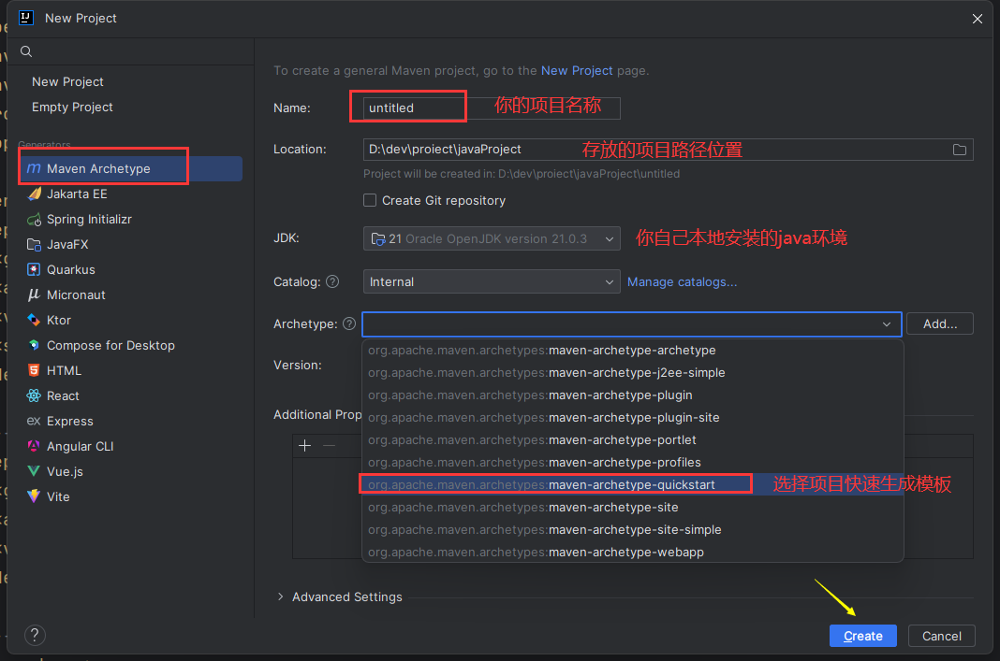

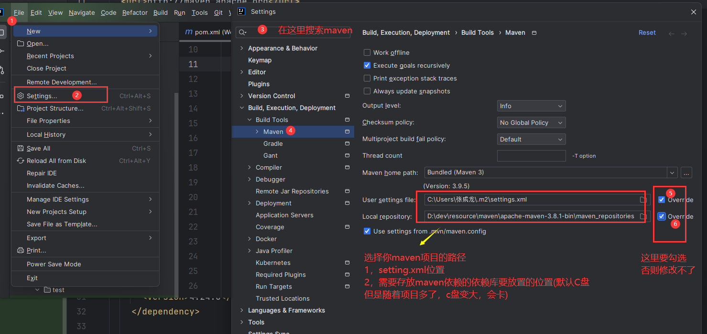


以上遇到Maven问题，自行百度一下就能解决，资料很多网上


## 依赖添加

创建完毕项目之后，在pom.xml中添加我们需要的基础依赖

pom.xml

~~~~xml
  <dependencies>
    
    <!--selenium 依赖-->
    <dependency>
      <groupId>org.seleniumhq.selenium</groupId>
      <artifactId>selenium-java</artifactId>
      <version>4.24.0</version>
    </dependency>

    <!--浏览器驱动代理 不用下载浏览器驱动 自动检测下载-->
    <dependency>
      <groupId>io.github.bonigarcia</groupId>
      <artifactId>webdrivermanager</artifactId>
      <version>5.9.2</version>
    </dependency>

    <!--提供了好用的工具类 文件操作 用于selenium 截图存放使用-->
    <dependency>
      <groupId>commons-io</groupId>
      <artifactId>commons-io</artifactId>
      <version>2.16.1</version>
    </dependency>
    <dependency>
      <groupId>org.testng</groupId>
      <artifactId>testng</artifactId>
      <version>7.9.0</version>
      <scope>test</scope>
    </dependency>

    <!-- Allure dependency for attaching screenshots 将截图添加到allure报告中-->
    <dependency>
      <groupId>io.qameta.allure</groupId>
      <artifactId>allure-java-commons</artifactId>
      <version>2.17.2</version>
    </dependency>

    <!--allure  testng -->
    <dependency>
      <groupId>io.qameta.allure</groupId>
      <artifactId>allure-testng</artifactId>
      <version>2.20.1</version>
    </dependency>
  </dependencies>
~~~~


## 项目实操

### api

在项目目录下创建api项目包，用于存放项目目录地址

- PROD 生产环境
- TEST 测试环境
- DEV 开发环境


您可以使用 Java 枚举类，也可以使用配置文件的形式进行配置，然后读取配置文件中的变量，此使用枚举类进行枚举


在api项目包下面创建 EnvironmentType Java类 ，表示这是环境的类型选择


#### EnvironmentType

~~~~java
public enum EnvironmentType {

    PROD("https://www.PROD.com"),
    TEST("https://www.TEST.com"),
    DEV("https://www.DEV.com");

    private final String url;

    EnvironmentType(String apiBaseUrl) {
        this.url = apiBaseUrl;
    }

    // 您可以通过 EnvironmentType.xxx.getUrl() 来获取枚举value值 
    // 例如：EnvironmentType.TEST.getUrl() 获取TEST 枚举中的值：https://www.TEST.com
    public String getUrl() {
        return url;
    }

    // 静态方法，您也可以直接通过枚举名获取 URL
    // 例如：EnvironmentType.getUrlByType(EnvironmentType.TEST) 同样可以获取 TEST 枚举中的值：https://www.TEST.com
    public static String getUrlByType(EnvironmentType environmentType) {
        return environmentType.getUrl();
    }
}

~~~~


### enums

在这里我们将常用的枚举类或者是自定义的枚举类放置在此，例如不同的浏览器对象等等，您也可以统一管理枚举类，这里仅仅当作个人习惯使用

在此包下面放置浏览器的不同对象，例如：谷歌、火狐、EDGE等，使用枚举类可以在数量不是很多的情况下可以很方便的利于我们后期的扩展

#### BrowserType


~~~~java
public enum BrowserType {

    CHROME, // 谷歌
    FIREFOX, // 火狐
    EDGE // EDGE
}

~~~~


### util

用于存放常用的工具类函数，根据POM模式的封装解耦思想，将创建浏览器驱动对象、基本查找元素、元素逻辑操作处理进行封装

为了和 Python习惯保持一致，因此，在这里也采用Base的概念进行描述

util 存放的是 Driver 驱动对象 

而查找元素、元素逻辑处理则放在Base包当中，使得与 Python习惯保持一致


#### WebDriverUtil

~~~~java
package org.ceiling.utils;

import io.github.bonigarcia.wdm.WebDriverManager;
import org.ceiling.api.EnvironmentType;
import org.ceiling.enums.BrowserType;
import org.openqa.selenium.WebDriver;
import org.openqa.selenium.chrome.ChromeDriver;
import org.openqa.selenium.firefox.FirefoxDriver;
import org.openqa.selenium.edge.EdgeDriver;

import java.time.Duration;
import java.util.concurrent.TimeUnit;

public class WebDriverUtil {

    private static WebDriver driver;

    // 私有构造方法，防止外部实例化
    private WebDriverUtil(){}

    // 使用BrowserType枚举来创建WebDriver实例
    public static WebDriver getDriver(BrowserType browserType) {
        if (driver == null) {
            switch (browserType) {
                case CHROME:
                    WebDriverManager.chromedriver().setup();
                    driver = new ChromeDriver();
                    break;
                case FIREFOX:
                    WebDriverManager.firefoxdriver().setup();
                    driver = new FirefoxDriver();
                    break;
                case EDGE:
                    WebDriverManager.edgedriver().setup();
                    driver = new EdgeDriver();
                    break;
                default:
                    throw new IllegalArgumentException("不支持的浏览器类型: " + browserType);
            }

            // 配置通用设置，比如隐式等待时间
            // 表示隐式等待10s 以下两种方式均可
            // driver.manage().timeouts().implicitlyWait(Duration.ofSeconds(10));
            // driver.manage().timeouts().implicitlyWait(10, TimeUnit.SECONDS);

            // 获取环境 url 您也可以使用 application.properties 类似的配置文件形式 方式多样化 这里使用枚举类
            // 您也可以通过 EnvironmentType.TEST.getUrl() 的方式来获取其值
            driver.get(EnvironmentType.getUrlByType(EnvironmentType.TEST));
            driver.manage().window().maximize();
        }
        return driver;
    }

    // 关闭并释放资源的方法
    public static void quitDriver() {
        if (driver != null) {
            driver.quit();
            driver = null;
        }
    }
}

~~~~


### base

为了和Python习惯保持一致，以及采用POM设计模式中基类的概念，因此创建了此包，您也可以将其放在utils工具类下面，这不是必须

根据POM设计模式概念以及核心思想，可以设计结合Spring MVC 三层架构思想，其两者目的不尽相同，都是为了方便维护以及解耦

我们针对页元素，结合POM设计模式，可以做以下拆分：

- BasePage：查找元素的工具类
- BaseHandler：负责元素操作的工具类

后续只需要继承两者，进行不同的操作即可


#### BasePage


~~~~java
import org.ceiling.enums.BrowserType;
import org.ceiling.utils.WebDriverUtil;
import org.openqa.selenium.By;
import org.openqa.selenium.WebDriver;
import org.openqa.selenium.WebElement;
import org.openqa.selenium.support.ui.ExpectedConditions;
import org.openqa.selenium.support.ui.WebDriverWait;
import java.time.Duration;
import java.util.List;
import java.util.logging.Logger;

public class BasePage {

    protected WebDriver driver;
    private static final Logger logger = Logger.getLogger(BasePage.class.getName());

    // 构造函数，初始化 WebDriver 使用同一个浏览器驱动对象 防止多次创建对象
    public BasePage() {
        this.driver = WebDriverUtil.getDriver(BrowserType.CHROME); // 这里使用 谷歌浏览器作为示例
    }

    // 显示等待获取单个元素
    public WebElement getElement(By locator, int timeoutInSeconds) {
        WebDriverWait wait = new WebDriverWait(driver, Duration.ofSeconds(timeoutInSeconds));
        // ExpectedConditions.visibilityOfAllElementsLocatedBy(locator) 会内部自动调用 findElements 来实现定位和查找元素的功能。
        // ExpectedConditions.visibilityOfAllElementsLocatedBy(locator)，这是一个条件，它会等待直到所有由 locator 指定的元素在页面上可见。
        WebElement element = wait.until(ExpectedConditions.visibilityOfElementLocated(locator));
        logger.info("Element found: " + locator);
        return element;
    }

    // 默认 10 秒超时的 getElement 方法
    public WebElement getElement(By locator) {
        logger.info("Element found: " + locator);
        return getElement(locator, 10);

    }

    // 显示等待获取多个元素
    public List<WebElement> getElements(By locator, int timeoutInSeconds) {
        WebDriverWait wait = new WebDriverWait(driver, Duration.ofSeconds(timeoutInSeconds));
        List<WebElement> elements = wait.until(ExpectedConditions.visibilityOfAllElementsLocatedBy(locator));
        logger.info("Elements found: " + locator);
        return elements;
    }

    // 默认 10 秒超时的 getElements 方法
    public List<WebElement> getElements(By locator) {
        logger.info("Elements found: " + locator);
        return getElements(locator, 10);
    }


}


~~~~


#### BaseHandler


~~~~java
import io.qameta.allure.Allure;
import org.apache.commons.io.FileUtils;
import org.ceiling.enums.BrowserType;
import org.ceiling.utils.WebDriverUtil;
import org.openqa.selenium.*;
import org.openqa.selenium.interactions.Actions;
import org.openqa.selenium.support.ui.ExpectedConditions;
import org.openqa.selenium.support.ui.Select;
import org.openqa.selenium.support.ui.WebDriverWait;

import javax.lang.model.element.Element;
import java.io.ByteArrayInputStream;
import java.io.File;
import java.io.IOException;
import java.time.Duration;
import java.util.List;
import java.util.logging.Logger;

public class BaseHandler {

    private final WebDriver driver;
    private static final Logger logger = Logger.getLogger(BaseHandler.class.getName());

    // Constructor to initialize WebDriver from WebDriverUtil
    public BaseHandler() {
        this.driver = WebDriverUtil.getDriver(BrowserType.CHROME); // Get driver from WebDriverUtil google
    }

    /**
     *
     * @param element element 对象
     */
    public void clickElement(WebElement element) {
//        WebElement element = getElement(locator); // Use getElement method for element retrieval
        element.click();
        logger.info("Clicked on the element: "  + element);
    }


    /**
     *
     * @param element element 对象
     * @param content 输入文本框的内容
     */
    public void inputText(WebElement element, String content) {
//        WebElement element = getElement(locator); // Use getElement method for element retrieval
        element.clear();
        element.sendKeys(content);
        logger.info("Input text: " + content + " into element: " + element);
    }

    /**
     * Switch to a specified iframe
     * @param element WebElement representing the iframe
     */
    public void switchToIframe(WebElement element) {
        driver.switchTo().frame(element);
        logger.info("Switched to iframe: " + element);
    }

    /**
     * Switch back to the main content from an iframe
     */
    public void switchToDefaultContent() {
        driver.switchTo().defaultContent();
        logger.info("Switched back to default content");
    }

    /**
     * Execute JavaScript command on the current page
     * @param script JavaScript code to execute
     * @param args Arguments that the JavaScript code might require
     * @return Object result of the script execution
     */
    public Object executeJavaScript(String script, Object... args) {
        JavascriptExecutor jsExecutor = (JavascriptExecutor) driver;
        Object result = jsExecutor.executeScript(script, args);
        logger.info("Executed JavaScript: " + script);
        return result;
    }

    /**
     * Switch to a window by its handle
     * @param handle Window handle to switch to
     */
    public void switchToWindow(String handle) {
        driver.switchTo().window(handle);
        logger.info("Switched to window with handle: " + handle);
    }

    /**
     * Switch to the last opened window
     */
    public void switchToLastWindow() {
        for (String handle : driver.getWindowHandles()) {
            driver.switchTo().window(handle);
        }
        logger.info("Switched to the last opened window");
    }

    /**
     * Scroll to a specific element on the page
     * @param element WebElement to scroll to
     */
    public void scrollToElement(WebElement element) {
        // 使用 JavaScript 执行器来运行 JavaScript 代码，作用是让传入的元素滚动到可视区域。
        // arguments[0] 是指 JavaScript 中的第一个参数，这里传入的是 element
        // {block: 'center', inline: 'center'}  表示上下左右都可以滚动到视图可见的区域
        executeJavaScript("arguments[0].scrollIntoView({block: 'center', inline: 'center'});", element);
        logger.info("Scrolled to element: " + element);
    }

    /**
     * Get the current window handle
     * @return String current window handle
     */
    public String getCurrentWindowHandle() {
        String handle = driver.getWindowHandle();
        logger.info("Current window handle: " + handle);
        return handle;
    }

    /**
     * Close the current window and switch back to the main window
     */
    public void closeCurrentWindowAndSwitchBack() {
        String mainWindow = driver.getWindowHandle();
        driver.close();
        logger.info("Closed the current window");

        // Switch back to main window
        driver.switchTo().window(mainWindow);
        logger.info("Switched back to the main window");
    }


    /**
     * Hover over a specific element
     * @param element WebElement to hover over
     */
    public void hoverOverElement(WebElement element) {
        Actions actions = new Actions(driver);
        actions.moveToElement(element).perform();
        logger.info("Hovered over element: " + element);
    }

    /**
     * Drag one element and drop it onto another element
     * @param source WebElement to drag
     * @param target WebElement where the source element will be dropped
     */
    public void dragAndDrop(WebElement source, WebElement target) {
        Actions actions = new Actions(driver);
        actions.dragAndDrop(source, target).perform();
        logger.info("Dragged element: " + source + " and dropped onto: " + target);
    }


    /**
     * Select a value from a dropdown by visible text
     * @param element WebElement representing the dropdown
     * @param visibleText The visible text to select
     */
    public void selectFromDropdownByVisibleText(WebElement element, String visibleText) {
        Select select = new Select(element);
        select.selectByVisibleText(visibleText);
        logger.info("Selected value from dropdown: " + visibleText);
    }


    /**
     * Take a screenshot and save it to the specified path
     * @param filePath The path where the screenshot will be saved
     * @throws IOException If there's an issue with saving the screenshot
     */
    public void takeScreenshot(String filePath, String fileName) throws IOException {
        File screenshot = ((TakesScreenshot) driver).getScreenshotAs(OutputType.FILE);
        String fullPath = filePath + File.separator + fileName + ".png"; // .png 格式
//        FileUtils.copyFile(screenshot, new File(filePath, fileName + ".png"));
        FileUtils.copyFile(screenshot, new File(fullPath)); // 这里就使用到了commons-io提供的FileUtils 文件工具类操作方法
        logger.info("Screenshot saved to: " + fullPath);

        // Convert screenshot to byte array
        byte[] screenshotBytes = FileUtils.readFileToByteArray(screenshot);

        // Attach screenshot to Allure report
        Allure.addAttachment("Screenshot", new ByteArrayInputStream(screenshotBytes));
    }

}

~~~~


### 百度示例

以上是前期的准备工作，接下来以百度搜索为例子，然后实现Web UI自动化，并且将结果截图保存到本地，添加到Allure测试报告当作

#### page

在此包下面书写我们的具体元素，并将元素返回，供继承BaseHandler的类将元素处理

##### BaiduElement


~~~~java
import org.ceiling.base.BasePage;
import org.openqa.selenium.By;
import org.openqa.selenium.WebElement;

// 继承BasePage 使用里面的查找单个元素的方式 getElement 进行元素的查找 并返回供 操作类使用
public class BaiduElement extends BasePage {

    private final By inputContent = By.id("kw"); // 使用id方式查找 百度输入框的元素

    private final By searchButton = By.id("su"); // 使用id方式查找 百度搜索按钮的元素


    // 将输入框元素返回

    public  WebElement findInputContentElement(){

        return getElement(inputContent);

    }

    // 将百度搜索按钮元素返回
    public WebElement findSearchButtonElement(){
        return getElement(searchButton);
    }

}
~~~~


#### service

在此包下面书写我们的具体元素的操作方式，然后供测试用例类将单个操作方式进行组装成流程

##### BaiduService

~~~~java
import org.ceiling.base.BaseHandler;
import org.ceiling.pages.BaiduElement;
import org.openqa.selenium.By;
import org.openqa.selenium.WebElement;

// 继承BaseHandler 具有父类中的方法 进行调用 操作元素

public class BaiduService extends BaseHandler {

    private static final BaiduElement baiduElement;

    // static 在类加载的时候使用 并且只会创建一次 
    static {
        baiduElement = new BaiduElement();
    }
    

    public void inputContent(String content){

        inputText(baiduElement.findInputContentElement(),content ); // 在输入框中输入元素

    }

    public void clickSearchButton() {
        clickElement(baiduElement.findSearchButtonElement()); // 点击搜素按钮
    }
}

~~~~


#### controller

在此包下面去组装 service的单个元素操作，使得其组成一个连贯性的整体流程，比如先输入，在点击

##### BaiduSearchController


~~~~java
import org.ceiling.service.BaiduService;

import java.io.IOException;

public class BaiduSearchController {

    private static final BaiduService baiduService;

    static {

      baiduService = new BaiduService();

    }

    public static void testBaiduSearchContent(){

        baiduService.inputContent("123"); // 先输入
        baiduService.clickSearchButton(); // 再点击

        try {
            Thread.sleep(3000); // 强制等待3秒 供截图使用
            baiduService.takeScreenshot("screenshot\\baidu", "百度搜索结果截图"); // 调用baiduService继承的父类BaseHandler中的截图方法
        } catch (IOException | InterruptedException e) {
            throw new RuntimeException(e);
        }
    }

}

~~~~


到此，流程已经组装完毕，在 Maven 提供的test包下面，进行专门的测试使用

## 项目运行


Maven 快速模板 提供了我们进行书写单元测试的位置包目录，因此，我们直接在此下面进行我们测试用例的编写

值得一提的是，最好test下目录与我们类目录一一对照，这有利于我们后期进行维护以及快速排查问题

运行方式有多种方式：

- 右键运行
- TestNG.xml集成(推荐，利于CICD持续集成)


### test(右键执行)

#### controller

##### TestBaiduSearchController

~~~~java
import org.testng.annotations.Test;

public class TestBaiduSearchController {

    @Test
    public void testBaiduSearchController(){

        BaiduSearchController.testBaiduSearchContent(); // 调用controller组装好的流程ui逻辑处理方法

    }


}

~~~~


#### 运行


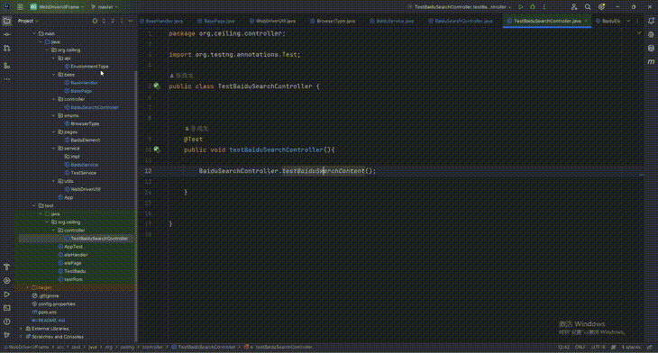


### TestNG.xml


TestNG 提供了xml方式格式运行测试用例套件，可以在xml中右键点击运行，也可以通过mvn 再终端输入 mvn test指定运行TestNG.xml文件进行运行

#### 前提准备

##### 下载TestNG  xml 生成插件

在IDEA  File -> Settings（快捷键 Ctrl + Alt + S）打开设置窗口

如图位置所示，搜索插件，进行安装：


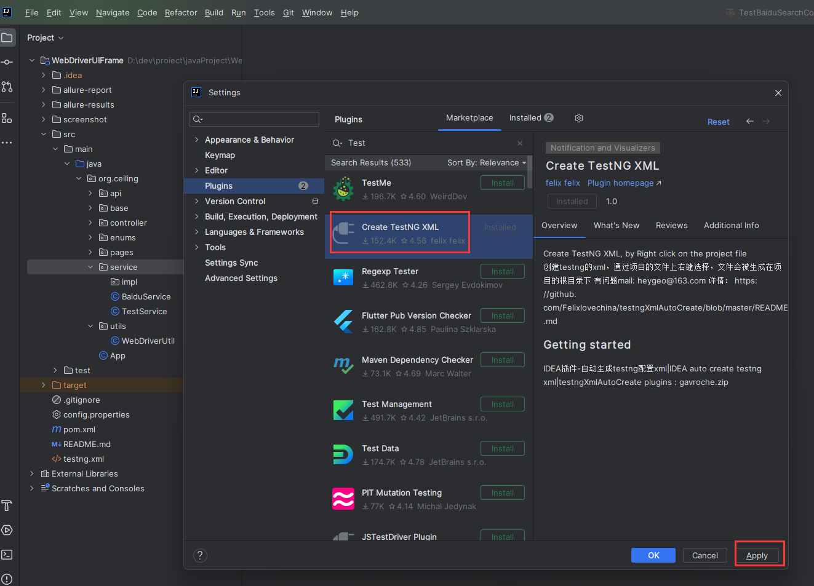


##### 使用插件

只需要在我们测试用例上右键，选择底部：Create TestNG Xml 即可自动生成TestNG XML 文件

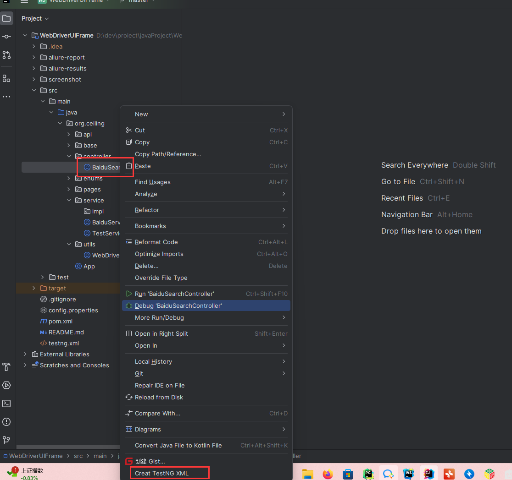


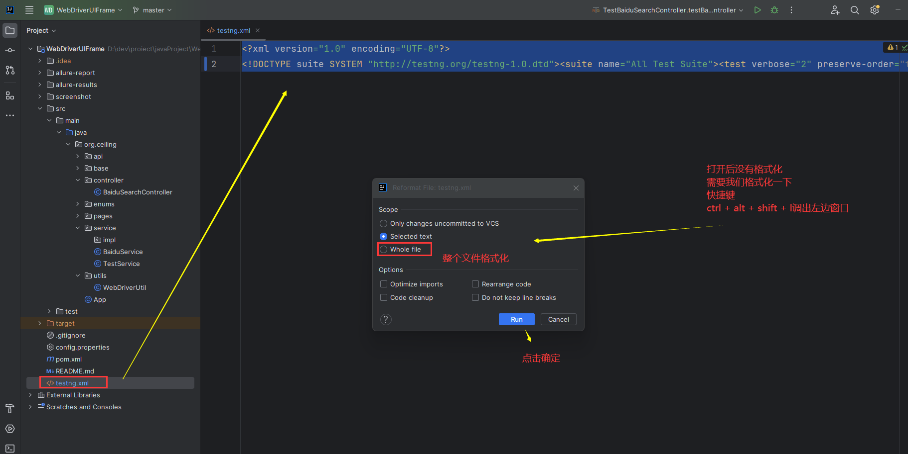


格式化之后的内容

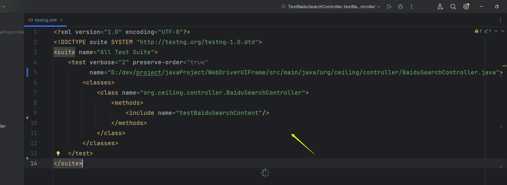


~~~~xml
<?xml version="1.0" encoding="UTF-8"?>
<!DOCTYPE suite SYSTEM "http://testng.org/testng-1.0.dtd">
<suite name="All Test Suite">
    <test verbose="2" preserve-order="true"
          name="测试百度">
        <classes>
            <class name="org.ceiling.controller.BaiduSearchController">
                <methods>
                    <include name="testBaiduSearchContent"/>
                </methods>
            </class>
        </classes>
    </test>

</suite>
~~~~


#### 运行

##### 右键

可以在TestNG xml文件中鼠标右键，点击运行

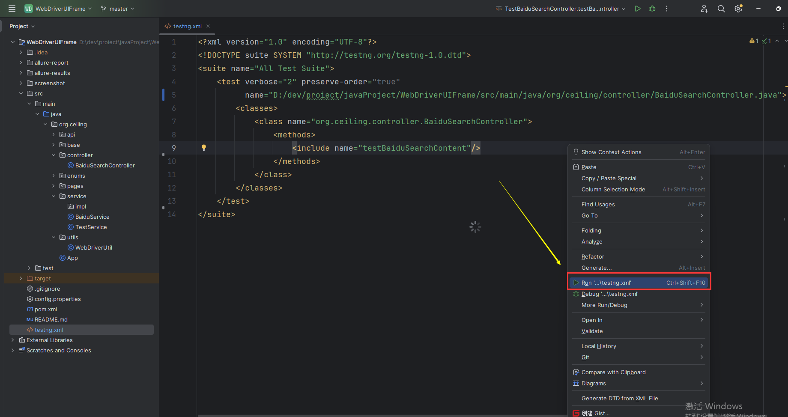


##### 终端运行

可以在终端执行命令：

`mvn test`

即可一键执行我们需要执行的文件，不过这个需要我们在 pom.xml 中指定要执行的文件是  testng,xml

pom文件新增内容如下：

如下 build 的内容，需要在 <dependencies>   </dependencies>  后面 添加 

~~~~xml

  <build>
    <plugins>
      <plugin>
        <groupId>org.apache.maven.plugins</groupId>
        <artifactId>maven-compiler-plugin</artifactId>
        <version>3.11.0</version>
        <configuration>
          <encoding>UTF-8</encoding>
          <source>1.8</source>
          <target>1.8</target>
        </configuration>
      </plugin>
      <!--maven-surefire-plugin的test目标会自动执行测试源码路径（默认为src/test/java/）下所有符合一组命名模式的测试类-->
      <plugin>
        <groupId>org.apache.maven.plugins</groupId>
        <artifactId>maven-surefire-plugin</artifactId>
        <version>2.7.1</version>
        <configuration>
          <!-- 测试失败后，是否忽略并继续测试 -->
          <testFailureIgnore>true</testFailureIgnore>
          <suiteXmlFiles>
            <suiteXmlFile>testng.xml</suiteXmlFile>
          </suiteXmlFiles>
        </configuration>
      </plugin>
    </plugins>
  </build>
~~~~


此时我们pom文件指定了运行根目录下面的testng.xml文件，我们只需要在终端执行命令 mvn test 即可


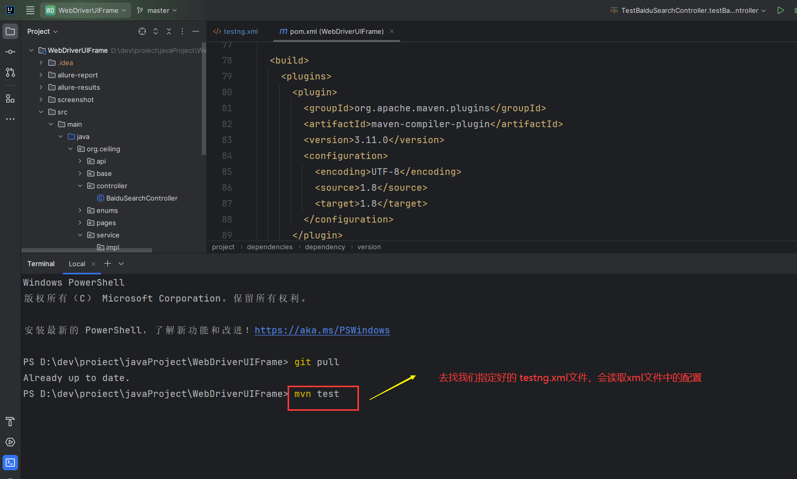


点击回车执行，运行结果与上述手动执行一致，不再贴图

后续利于持续集成，比如Jenkins，你只需要在终端命令行配置mvn test命令即可，不需要额外复杂的命令，因此推荐这种方式


## 测试报告

### 使用Allure第三方测试报告


上述项目运行完毕之后，在终端执行：

`allure generate 生成的json数据 -c -o 指定测试报告的位置`

打开测试报告index.html文件，查看测试报告

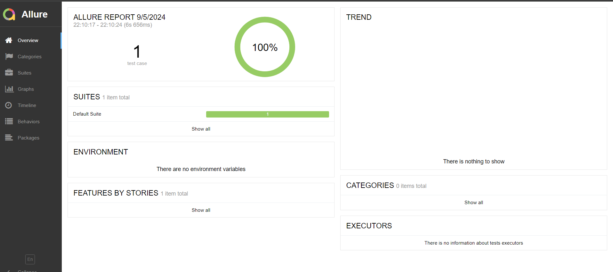


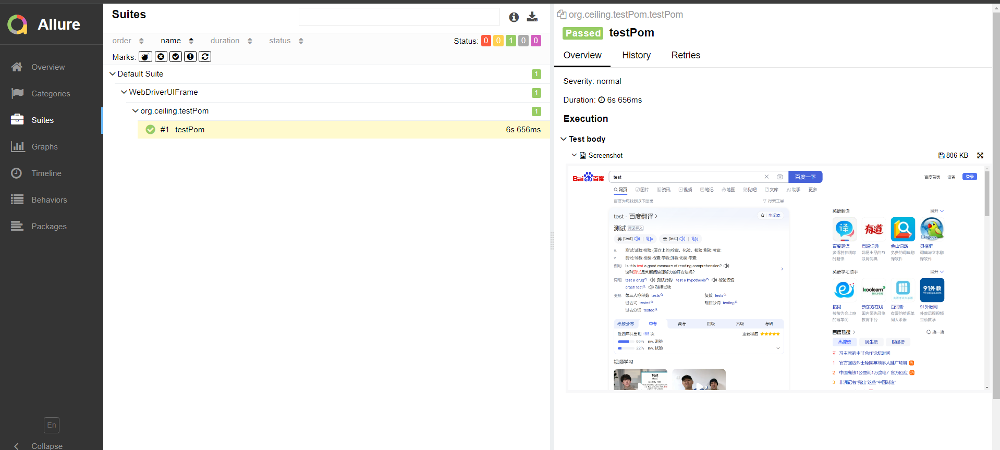


至此，简单的 demo 就搭建成功了


