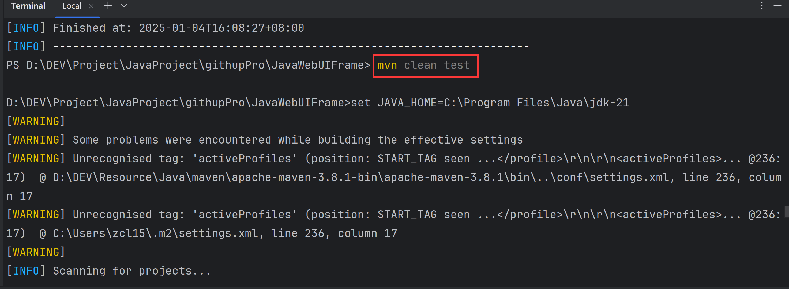

# Java + Selenium + TestNG + Allure

## 项目地址

### Gitee：

https://gitee.com/kang-kang520/WebDriverUIFrame

### CSDN：

https://blog.csdn.net/qq_45594960/article/details/142104058?spm=1001.2014.3001.5502

## 环境准备

- Java 环境 （我使用的是Java21 版本）注意： 需要配置 JAVA_HOME（Maven 运行需要查找 JAVA_HOME 环境 ）
- Maven 环境 （我使用的是 Maven 3.8.1 版本） 
- Allure 环境（我使用的是 Allure 2.20.1）

以上需要配置环境变量path，上述环境变量配置不在赘述

开发工具：

- 以下为IDEA演示  版本：IDEA 2024.4.1

## 项目运行方式

在终端中执行 `mvn clean test` 即可运行上述demo，demo运行案例为：百度搜索



注意：如果使用低版本Maven 想要在执行 `mvn clean test`  时候 更改 JAVA_HOME 指定 JDK 版本

那么请参考如下：[如何修改Maven JAVA_HOME 指定JDK版本](https://blog.csdn.net/qq_45594960/article/details/144592462?spm=1001.2014.3001.5501)

## 项目目录结构介绍

```
项目目录结构：
src
 |- mian
   |-- java/org/ceiling
        - api : 存放项目访问路径位置
        - base : 存放访问元素以及操作元素的方法，用于后续继承
          - BasePage : 访问元素
          - BaseService : 操作元素
        - controller: 执行页面流程逻辑处理
        - enums: 自定义的枚举类
          - BrowserType : 表示浏览器的支持类型
        - pages: 表示页面元素的存储
        - service: 表示操作页面元素
        - utils: 表示常用工具类
   |-- resources
        -logback.xml : 集成logback日志
 |- test
 		-xxxtest: 存放测试文件的位置
 
- config.properties: 核心配置文件
- pom.xml: maven 依赖文件
- testng.xml: 测试用例套件
```

## 核心配置文件

在根目录下 `config.properties` 核心配置文件，文件内容如下：

```properties
# 设置要使用的浏览器类型 支持 CHROME、EDGE、FIREFOX 大小写均可 可不写 默认为 CHROME 
driver.browser.type=chrome
# 访问目标链接地址（必须配置）
driver.url=https://www.baidu.com
# 隐式等待时间 默认为 10 可不写 
driver.implicit.wait=15
# 启用无头模式（true 或 false，不区分大小写） 可不写 默认为false
driver.headless=false 
```

这个文件必须创建在根目录下，最低需要配置 目标链接访问地址

以下介绍项目搭建详情

## 搭建项目

### 创建maven项目

使用IDEA创建一个Maven项目


### 依赖添加

创建完毕项目之后，在pom.xml中添加我们需要的基础依赖

pom.xml

~~~~xml
  <dependencies>
    
    <!--selenium 依赖-->
    <dependency>
      <groupId>org.seleniumhq.selenium</groupId>
      <artifactId>selenium-java</artifactId>
      <version>4.24.0</version>
    </dependency>

    <!--浏览器驱动代理 不用下载浏览器驱动 自动检测下载-->
    <dependency>
      <groupId>io.github.bonigarcia</groupId>
      <artifactId>webdrivermanager</artifactId>
      <version>5.9.2</version>
    </dependency>

    <!--提供了好用的工具类 文件操作 用于selenium 截图存放使用-->
    <dependency>
      <groupId>commons-io</groupId>
      <artifactId>commons-io</artifactId>
      <version>2.16.1</version>
    </dependency>
    <dependency>
      <groupId>org.testng</groupId>
      <artifactId>testng</artifactId>
      <version>7.9.0</version>
      <scope>test</scope>
    </dependency>

    <!-- Allure dependency for attaching screenshots 将截图添加到allure报告中-->
    <dependency>
      <groupId>io.qameta.allure</groupId>
      <artifactId>allure-java-commons</artifactId>
      <version>2.17.2</version>
    </dependency>

    <!--allure  testng -->
    <dependency>
      <groupId>io.qameta.allure</groupId>
      <artifactId>allure-testng</artifactId>
      <version>2.20.1</version>
    </dependency>
      
     <!-- SLF4J API (日志接口) -->
    <dependency>
      <groupId>org.slf4j</groupId>
      <artifactId>slf4j-api</artifactId>
      <version>1.7.32</version>
    </dependency>

    <!-- Logback (SLF4J 的实现) -->
    <dependency>
      <groupId>ch.qos.logback</groupId>
      <artifactId>logback-classic</artifactId>
      <version>1.2.6</version>
    </dependency>

    <!-- Logback 配置文件（如果有） -->
    <dependency>
      <groupId>ch.qos.logback</groupId>
      <artifactId>logback-core</artifactId>
      <version>1.2.6</version>
    </dependency> 
  </dependencies>

<build>
    <defaultGoal>compile</defaultGoal>
    <plugins>
      <plugin>
        <groupId>org.apache.maven.plugins</groupId>
        <artifactId>maven-compiler-plugin</artifactId>
        <version>3.11.0</version>
        <configuration>
          <encoding>UTF-8</encoding>
          <source>21</source>
          <target>21</target>
        </configuration>
      </plugin>
      <!--maven-surefire-plugin的test目标会自动执行测试源码路径（默认为src/test/java/）下所有符合一组命名模式的测试类-->
      <plugin>
        <groupId>org.apache.maven.plugins</groupId>
        <artifactId>maven-surefire-plugin</artifactId>
        <version>3.0.0-M5</version>
        <configuration>
          <!-- 测试失败后，是否忽略并继续测试 -->
          <testFailureIgnore>true</testFailureIgnore>
          <suiteXmlFiles>
            <suiteXmlFile>testng.xml</suiteXmlFile>
          </suiteXmlFiles>
        </configuration>
      </plugin>
    </plugins>
  </build>
~~~~

## 项目实操

### api

在项目目录下创建api项目包，用于获取核心配置文件中的项目目录地址

#### EnvironmentType

~~~~java
package org.ceiling.api;

import org.ceiling.utils.PropertiesUtil;

public enum EnvironmentType {
	 // 获取 config.properties 中 driver.url 的值 
    TEST(PropertiesUtil.getProperty("driver.url"));

    private final String url;

    EnvironmentType(String apiBaseUrl) {
        this.url = apiBaseUrl;
    }

    public String getUrl() {
        return url;
    }

    // 静态方法，直接通过枚举名获取 URL
    public static String getUrlByType(EnvironmentType environmentType) {
        return environmentType.getUrl();
    }

}

~~~~


### enums

在这里我们将常用的枚举类或者是自定义的枚举类放置在此，例如不同的浏览器对象等等，您也可以统一管理枚举类，这里仅仅当作个人习惯使用

在此包下面放置浏览器的不同对象，例如：谷歌、火狐、EDGE等，使用枚举类可以在数量不是很多的情况下可以很方便的利于我们后期的扩展

#### BrowserType

~~~~java
public enum BrowserType {
    CHROME, // 谷歌
    FIREFOX, // 火狐
    EDGE // EDGE
}

~~~~

### utils

用于存放常用的工具类函数，根据POM模式的封装解耦思想，将创建浏览器驱动对象、基本查找元素、元素逻辑操作处理进行封装

为了和 Python 习惯保持一致，因此，在这里也采用 Base 的概念进行描述

utils 存放的是常见的工具类，例如 Web Driver 驱动对象 、跨平台文件上传等

#### WebDriverUtil

~~~~java
package org.ceiling.utils;

import io.github.bonigarcia.wdm.WebDriverManager;
import org.ceiling.api.EnvironmentType;
import org.ceiling.enums.BrowserType;
import org.openqa.selenium.WebDriver;
import org.openqa.selenium.chrome.ChromeDriver;
import org.openqa.selenium.chrome.ChromeOptions;
import org.openqa.selenium.edge.EdgeDriver;
import org.openqa.selenium.edge.EdgeOptions;
import org.openqa.selenium.firefox.FirefoxDriver;
import org.openqa.selenium.firefox.FirefoxOptions;
import org.slf4j.Logger;
import org.slf4j.LoggerFactory;

import java.time.Duration;

public class WebDriverUtil {
    private static final Logger logger = LoggerFactory.getLogger(WebDriverUtil.class);

    // 配置无头模式 浏览器大小常量，避免重复
    private static final String HEADLESS_OPTION = "--headless";
    private static final String WINDOW_SIZE_OPTION = "--window-size=1920x1080";

    // 隐式等待时间，读取配置文件
    private static final int implicitWait;
    private static final boolean headless;

    // 使用 ThreadLocal 管理 WebDriver，保证线程安全
    private static final ThreadLocal<WebDriver> threadLocalDriver = new ThreadLocal<>();

    static {
        int tempWait;
        try {
            tempWait = Integer.parseInt(PropertiesUtil.getProperty("driver.implicit.wait", "10"));
        } catch (NumberFormatException e) {
            tempWait = 10; // 配置值无效时，使用默认值
            logger.info("The driver implicity wait value in the configuration file is invalid. The default value is used: {}", tempWait);
        }
        implicitWait = tempWait;

        // 读取 headless 配置项  若没有该项，则默认值为 false
        String headlessProperty = PropertiesUtil.getProperty("driver.headless", "false").trim();
        // 如果配置为空或为 "false"（不区分大小写），则设置为 false；如果为 "true"，则设置为 true
        headless = headlessProperty.equalsIgnoreCase("true");
        logger.info("无头模式配置: {}", headless ? "启用" : "禁用");
    }

    // 初始化 WebDriver
    public static WebDriver getDriver(BrowserType browserType) {
        if (threadLocalDriver.get() == null) {
            WebDriver driver = createDriver(browserType);
            configureDriver(driver);
            threadLocalDriver.set(driver);
        }
        return threadLocalDriver.get();
    }

    // 关闭 WebDriver 并清理线程资源
    public static void quitDriver() {
        WebDriver driver = threadLocalDriver.get();
        if (driver != null) {
            driver.quit();
            threadLocalDriver.remove();
        }
    }

    // 创建 WebDriver 实例
    private static WebDriver createDriver(BrowserType browserType) {
        WebDriver driver;
        switch (browserType) {
            case CHROME:
                WebDriverManager.chromedriver().setup();
                ChromeOptions chromeOptions = new ChromeOptions();
                if (headless) {
                    chromeOptions.addArguments(HEADLESS_OPTION);  // 启用无头模式
                    chromeOptions.addArguments(WINDOW_SIZE_OPTION);  // 设置窗口大小
                }
                driver = new ChromeDriver(chromeOptions);
                logger.info("CHROME browser started successfully, opening the website...");
                break;
            case FIREFOX:
                WebDriverManager.firefoxdriver().setup();
                FirefoxOptions firefoxOptions = new FirefoxOptions();
                if (headless) {
                    firefoxOptions.addArguments(HEADLESS_OPTION);  // 启用无头模式
                    firefoxOptions.addArguments(WINDOW_SIZE_OPTION);  // 设置窗口大小
                }
                driver = new FirefoxDriver(firefoxOptions);
                logger.info("FIREFOX browser started successfully, opening the website...");
                break;
            case EDGE:
                WebDriverManager.edgedriver().setup();
                EdgeOptions edgeOptions = new EdgeOptions();
                if (headless) {
                    edgeOptions.addArguments(HEADLESS_OPTION);  // 引用常量
                    edgeOptions.addArguments(WINDOW_SIZE_OPTION);  // 引用常量
                }
                driver = new EdgeDriver(edgeOptions);
                logger.info("EDGE browser started successfully, opening the website...");
                break;
            default:
                throw new IllegalArgumentException("Unsupported browser types: " + browserType);
        }
        return driver;
    }

    // 配置 WebDriver 通用设置
    private static void configureDriver(WebDriver driver) {
        driver.manage().timeouts().implicitlyWait(Duration.ofSeconds(implicitWait));
        driver.manage().window().maximize();
        String url = EnvironmentType.getUrlByType(EnvironmentType.TEST); // 读取环境 URL
        driver.get(url);
        logger.info("Open URL: " + url);
    }
}

~~~~


### base

为了和Python习惯保持一致，以及采用POM设计模式中基类的概念，因此创建了此包，您也可以将其放在utils工具类下面，这不是必须

根据POM设计模式概念以及核心思想，可以设计结合Spring MVC 三层架构思想，其两者目的不尽相同，都是为了方便维护以及解耦

我们针对页元素，结合POM设计模式，可以做以下拆分：

- BasePage：查找元素的工具类 例如 `findElement`、`findElements`
- BaseService：负责元素操作的工具类 例如 `click` 点击元素、`sendKeys` 输入内容

后续只需要继承两者，进行不同的操作即可

#### BasePage

~~~~java
package org.ceiling.base;
import org.ceiling.enums.BrowserType;
import org.ceiling.utils.PropertiesUtil;
import org.ceiling.utils.WebDriverUtil;
import org.openqa.selenium.By;
import org.openqa.selenium.WebDriver;
import org.openqa.selenium.WebElement;
import org.openqa.selenium.support.ui.ExpectedConditions;
import org.openqa.selenium.support.ui.WebDriverWait;
import org.slf4j.Logger;
import org.slf4j.LoggerFactory;

import java.time.Duration;
import java.util.List;

public class BasePage {

    private static final Logger logger = LoggerFactory.getLogger(BasePage.class);
    private final WebDriver driver;
    private static final BrowserType browserType = BrowserType.valueOf(PropertiesUtil.getProperty("driver.browser.type", "CHROME").toUpperCase());


    // 构造函数，初始化 WebDriver
    public BasePage() {
        this.driver = WebDriverUtil.getDriver(browserType);
    }

    // 显示等待获取单个元素
    public WebElement getElement(By locator, int timeoutInSeconds) {
        WebDriverWait wait = new WebDriverWait(driver, Duration.ofSeconds(timeoutInSeconds));
        // ExpectedConditions.visibilityOfAllElementsLocatedBy(locator) 会内部自动调用 findElement 来实现定位和查找元素的功能。
        // ExpectedConditions.visibilityOfAllElementsLocatedBy(locator)，这是一个条件，它会等待直到所有由 locator 指定的元素在页面上可见。
        WebElement element = wait.until(ExpectedConditions.visibilityOfElementLocated(locator));
        logger.info("Element found: " + locator);
        return element;
    }

    // 默认 10 秒超时的 getElement 方法
    public WebElement getElement(By locator) {
        logger.info("Element found: " + locator);
        return getElement(locator, 10);

    }

    // 显示等待获取多个元素
    public List<WebElement> getElements(By locator, int timeoutInSeconds) {
        WebDriverWait wait = new WebDriverWait(driver, Duration.ofSeconds(timeoutInSeconds));
        List<WebElement> elements = wait.until(ExpectedConditions.visibilityOfAllElementsLocatedBy(locator));
        logger.info("Elements found: " + locator);
        return elements;
    }

    // 默认 10 秒超时的 getElements 方法
    public List<WebElement> getElements(By locator) {
        logger.info("Elements found: " + locator);
        return getElements(locator, 10);
    }

}

~~~~


#### BaseService

~~~~java
package org.ceiling.base;

import io.qameta.allure.Allure;
import org.apache.commons.io.FileUtils;
import org.ceiling.enums.BrowserType;
import org.ceiling.utils.CrossPlatformFileUploader;
import org.ceiling.utils.PropertiesUtil;
import org.ceiling.utils.WebDriverUtil;
import org.openqa.selenium.*;
import org.openqa.selenium.interactions.Actions;
import org.openqa.selenium.support.ui.Select;
import org.slf4j.Logger;
import org.slf4j.LoggerFactory;

import java.awt.*;
import java.io.ByteArrayInputStream;
import java.io.File;
import java.io.IOException;

public class BaseService {

    private static final Logger logger = LoggerFactory.getLogger(BaseService.class);
    private final WebDriver driver;
    private static final BrowserType browserType = BrowserType.valueOf(PropertiesUtil.getProperty("driver.browser.type", "CHROME").toUpperCase());


    // Constructor to initialize WebDriver from WebDriverUtil
    public BaseService() {
        this.driver = WebDriverUtil.getDriver(browserType); // Get driver from WebDriverUtil
    }

    /**
     * click the element  点击元素
     * @param element element 对象
     */
    public void clickElement(WebElement element) {
//        WebElement element = getElement(locator); // Use getElement method for element retrieval
        element.click();
        logger.info("Clicked on the element: {}", element);
    }


    /**
     * Input text into a text field 在文本框中输入内容
     * @param element WebElement representing the text field
     * @param content The text to input
     */
    public void inputText(WebElement element, String content) {
        element.clear();
        element.sendKeys(content);
        logger.info("Input text: {} into element: {}", content, element);
    }

    /**
     * Clear the content of a text field 清除文本框内容
     * @param element WebElement representing the text field
     */
    public void clearText(WebElement element) {
        element.clear();
        logger.info("Cleared content of the element: {}", element);
    }

    /**
     * Get the text of an element 获取元素的文本内容
     *
     * @param element WebElement to retrieve text from
     * @return Text content of the element
     */
    public String getElementText(WebElement element) {
        String text = element.getText();
        logger.info("Retrieved text from element: {}. Text: {}", element, text);
        return text;
    }

    /**
     * Get the value of an attribute of an element 获取元素的属性值
     *
     * @param element WebElement to get attribute from
     * @param attribute The attribute name (e.g., "href", "value")
     * @return The attribute value
     */
    public String getElementAttribute(WebElement element, String attribute) {
        String attributeValue = element.getAttribute(attribute);
        logger.info("Retrieved attribute: {} with value: {} from element: {}", attribute, attributeValue, element);
        return attributeValue;
    }


    /**
     * Switch to a specified iframe 切换到指定的 iframe
     * @param element WebElement representing the iframe
     */
    public void switchToIframe(WebElement element) {
        driver.switchTo().frame(element);
        logger.info("Switched to iframe: {}", element);
    }

    /**
     * Switch back to the main content from an iframe 切换回默认的内容（主文档）
     */
    public void switchToDefaultContent() {
        driver.switchTo().defaultContent();
        logger.info("Switched back to default content");
    }

    /**
     * Execute JavaScript command on the current page 执行 js 代码
     * @param script JavaScript code to execute
     * @param args Arguments that the JavaScript code might require
     * @return Object result of the script execution
     */
    public Object executeJavaScript(String script, Object... args) {
        JavascriptExecutor jsExecutor = (JavascriptExecutor) driver;
        Object result = jsExecutor.executeScript(script, args);
        logger.info("Executed JavaScript: {}", script);
        return result;
    }

    /**
     * Switch to a window by its handle 切换指定窗口
     * @param handle Window handle to switch to
     */
    public void switchToWindow(String handle) {
        driver.switchTo().window(handle);
        logger.info("Switched to window with handle: {}", handle);
    }

    /**
     * Switch to the last opened window 切换最新窗口
     */
    public void switchToLastWindow() {
        for (String handle : driver.getWindowHandles()) {
            driver.switchTo().window(handle);
        }
        logger.info("Switched to the last opened window");
    }

    /**
     * Scroll to a specific element on the page  滚动页面到指定元素的位置
     * @param element WebElement to scroll to
     */
    public void scrollToElement(WebElement element) {
        // 使用 JavaScript 执行器来运行 JavaScript 代码，作用是让传入的元素滚动到可视区域。
        // arguments[0] 是指 JavaScript 中的第一个参数，这里传入的是 element
        // executeJavaScript("arguments[0].scrollIntoView(true);", element); // 只会处理垂直滚动
        // {block: 'center', inline: 'center'}  表示上下左右都可以滚动到视图可见的区域
        executeJavaScript("arguments[0].scrollIntoView({block: 'center', inline: 'center'});", element);
        logger.info("Scrolled to element: {}", element);
    }

    /**
     * Get the current window handle  获取当前窗口的句柄
     * @return String current window handle
     */
    public String getCurrentWindowHandle() {
        String handle = driver.getWindowHandle();
        logger.info("Current window handle: {}", handle);
        return handle;
    }

    /**
     * Close the current window and switch back to the main window 关闭当前窗口并切换回主窗口
     */
    public void closeCurrentWindowAndSwitchBack() {
        String mainWindow = driver.getWindowHandle();
        driver.close();
        logger.info("Closed the current window");

        // Switch back to main window
        driver.switchTo().window(mainWindow);
        logger.info("Switched back to the main window");
    }


    /**
     * Hover over a specific element 悬停在某个元素上
     * @param element WebElement to hover over
     */
    public void hoverOverElement(WebElement element) {
        Actions actions = new Actions(driver);
        actions.moveToElement(element).perform();
        logger.info("Hovered over element: {}", element);
    }

    /**
     * 执行拖拽操作，将元素从源位置拖到目标位置
     * Drag one element and drop it onto another element
     * @param source WebElement to drag
     * @param target WebElement where the source element will be dropped
     */
    public void dragAndDrop(WebElement source, WebElement target) {
        Actions actions = new Actions(driver);
        actions.dragAndDrop(source, target).perform();
        logger.info("Dragged element: {} and dropped onto: {}", source, target);
    }


    /**
     * 通过可见文本选择下拉框中的选项
     * Select a value from a dropdown by visible text
     * @param element WebElement representing the dropdown
     * @param visibleText The visible text to select
     */
    public void selectDropdownByVisibleText(WebElement element, String visibleText) {
        Select select = new Select(element);
        select.selectByVisibleText(visibleText);
        logger.info("Selected option with text: {} from dropdown: {}", visibleText, element);
    }

    /**
     * 通过可见文本取消选择下拉框中的选项
     * Deselect a dropdown option by visible text
     *
     * @param element WebElement representing the dropdown
     * @param visibleText Visible text of the option to deselect
     */
    public void deselectDropdownByVisibleText(WebElement element, String visibleText) {
        Select dropdown = new Select(element);
        dropdown.deselectByVisibleText(visibleText);
        logger.info("Deselected option with text: {} from dropdown: {}", visibleText, element);
    }


     /**
      * 添加截图到 allure 报告上 保存到本地
     * Take a screenshot and save it to the specified path
     * @param filePath The path where the screenshot will be saved
     * @param fileName The name where the screenshot will be saved
     * @throws IOException If there's an issue with saving the screenshot
     */
    public void takeScreenshot(String filePath, String fileName) throws IOException {
        File screenshot = ((TakesScreenshot) driver).getScreenshotAs(OutputType.FILE);
        String fullPath = filePath + File.separator + fileName + ".png"; // .png 格式
//        FileUtils.copyFile(screenshot, new File(filePath, fileName + ".png"));
        FileUtils.copyFile(screenshot, new File(fullPath));
        logger.info("Screenshot saved to: {}", fullPath);
        // Convert screenshot to byte array
        byte[] screenshotBytes = FileUtils.readFileToByteArray(screenshot);
        // Attach screenshot to Allure report
        Allure.addAttachment(fileName, new ByteArrayInputStream(screenshotBytes));
    }

    
    /**
     * 添加截图到 allure 报告上 不保存到本地
     * Take a screenshot and save it to the specified path
     * @param fileName The name where the screenshot will be saved
     * @throws IOException If there's an issue with saving the screenshot
     */
    public void takeScreenshotNotSaveLocal(String fileName) throws IOException {
        File screenshot = ((TakesScreenshot) driver).getScreenshotAs(OutputType.FILE);
        // Convert screenshot to byte array
        byte[] screenshotBytes = FileUtils.readFileToByteArray(screenshot);
        // Attach screenshot to Allure report
        Allure.addAttachment(fileName, new ByteArrayInputStream(screenshotBytes));
    }


    /**
     * 跨平台上传本地文件 非浏览器元素
     * @param filePath upload the local file, such as win/mac/unx platform
     */
    public void CrossPlatformFileUploader(String filePath){
        try {
            CrossPlatformFileUploader.uploadFile(filePath);
        } catch (AWTException e) {
            throw new RuntimeException(e);
        }
    }

    /**
     * 获取当前浏览器的 URL
     * Get the current URL of the browser
     *
     * @return The current URL
     */
    public String getCurrentUrl() {
        String url = driver.getCurrentUrl();
        logger.info("Current URL: {}", url);
        return url;
    }

    /**
     * 导航到指定的 URL
     * Navigate to a URL
     *
     * @param url The URL to navigate to
     */
    public void navigateToUrl(String url) {
        driver.get(url);
        logger.info("Navigated to URL: {}", url);
    }

    /**
     * 关闭浏览器驱动
     * quit the web driver
     */
    public void quitDriver(){
        WebDriverUtil.quitDriver();
    }

}

~~~~


### 百度示例

以上是前期的准备工作，接下来以百度搜索为例子，然后实现Web UI自动化，并且将结果截图保存到本地，添加到Allure测试报告当作

#### page

在此包下面书写我们的具体元素，并将元素返回，供继承BaseHandler的类将元素处理

##### BaiduPage

~~~~java
import org.ceiling.base.BasePage;
import org.openqa.selenium.By;
import org.openqa.selenium.WebElement;

// 继承BasePage 使用里面的查找单个元素的方式 getElement 进行元素的查找 并返回供 操作类使用
public class BaiduPage extends BasePage {

    private final By inputContent = By.id("kw"); // 使用id方式查找 百度输入框的元素

    private final By searchButton = By.id("su"); // 使用id方式查找 百度搜索按钮的元素


    // 将输入框元素返回

    public WebElement findInputContentElement(){

        return getElement(inputContent);

    }

    // 将百度搜索按钮元素返回
    public WebElement findSearchButtonElement(){
        return getElement(searchButton);
    }

}
~~~~


#### service

在此包下面书写我们的具体元素的操作方式，然后供测试用例类将单个操作方式进行组装成流程

##### BaiduService

~~~~java
package org.ceiling.service;

import org.ceiling.base.BaseService;
import org.ceiling.pages.BaiduPage;

/**
 * service 元素操作层 (点击 输入等操作)
 */
public class BaiduService extends BaseService {

    private static final BaiduPage BAIDU_PAGE;

    static {
        BAIDU_PAGE = new BaiduPage();
    }

    /**
     *
     * @param content 输入框输入内容
     */
    public void inputContent(String content){

        inputText(BAIDU_PAGE.findInputContentElement(), content);

    }

    /**
     * 点击百度搜索按钮元素
     */
    public void clickSearchButton() {
        clickElement(BAIDU_PAGE.findSearchButtonElement());
    }
}

~~~~


#### controller

在此包下面去组装 service的单个元素操作，使得其组成一个连贯性的整体流程，比如先输入，再点击

##### BaiduSearchController

~~~~java
package org.ceiling.controller;

import io.qameta.allure.*;
import org.ceiling.service.BaiduService;

import java.io.IOException;
import org.testng.annotations.Test;

/**
 * controller 元素逻辑处理层
 * example 百度搜索逻辑:
 *    1 先在搜索框中输入要搜索的内容信息
 *    2 点击搜索按钮 进行搜索
 */
public class BaiduSearchController {

    private static final BaiduService baiduService = new BaiduService();

    @Test
    @Feature("模块名称")
    @Story("用例名称")
    @Issue("缺陷地址")
    @Description("用例描述")
    @Step("操作步骤")
    @Severity(SeverityLevel.BLOCKER) // 用例等级
    @Link("https://www.baidu.com") // 定义链接
    public static void testBaiduSearchContent(){

        Allure.step("在百度输入框中输入内容");
        baiduService.inputContent("123");
        Allure.step("点击百度搜索按钮");
        baiduService.clickSearchButton();

        try {
            Thread.sleep(2000);
            Allure.step("将百度搜索内容进行截图");
            baiduService.takeScreenshot("screenshot\\baidu", "百度搜索结果截图");
            // 退出浏览器驱动
            baiduService.quitDriver();
        } catch (IOException | InterruptedException e) {
            throw new RuntimeException(e);
        }

    }


}

~~~~


到此，流程已经组装完毕，在 Maven 项目提供的 test 包下面，进行专门的测试使用

## 项目运行

Maven 快速模板 提供了我们进行书写单元测试的位置包目录，因此，我们直接在此下面进行我们测试用例的编写

值得一提的是，最好test下目录与我们类目录一一对照，这有利于我们后期进行维护以及快速排查问题

运行方式有多种方式：

- 右键运行
- TestNG.xml集成(推荐，利于CICD持续集成)

### test(右键执行)

#### controller

##### TestBaiduSearchController

~~~~java
import org.testng.annotations.Test;

public class TestBaiduSearchController {

    @Test
    public void testBaiduSearchController(){
        BaiduSearchController.testBaiduSearchContent(); // 调用controller组装好的流程ui逻辑处理方法
    }

}

~~~~


#### 运行


### TestNG.xml

TestNG 提供了xml方式格式运行测试用例套件，可以在xml中右键点击运行，也可以通过mvn 再终端输入 mvn test指定运行TestNG.xml文件进行运行

#### 前提准备

##### 下载TestNG  xml 生成插件

在IDEA  File -> Settings（快捷键 Ctrl + Alt + S）打开设置窗口

如图位置所示，搜索插件，进行安装：


##### 使用插件

只需要在我们测试用例上右键，选择底部：Create TestNG Xml 即可自动生成TestNG XML 文件


格式化之后的内容


~~~~xml
<?xml version="1.0" encoding="UTF-8"?>
<!DOCTYPE suite SYSTEM "http://testng.org/testng-1.0.dtd">
<suite name="All Test Suite">
    <test verbose="2" preserve-order="true"
          name="测试百度">
        <classes>
            <class name="org.ceiling.controller.BaiduSearchController">
                <methods>
                    <include name="testBaiduSearchContent"/>
                </methods>
            </class>
        </classes>
    </test>

</suite>
~~~~


#### 运行

##### 右键

可以在TestNG xml文件中鼠标右键，点击运行


##### 终端运行（推荐）

可以在终端执行命令：

`mvn test`

即可一键执行我们需要执行的文件，不过这个需要我们在 pom.xml 中指定要执行的文件是  testng,xml

pom文件新增内容如下：

如下 build 的内容，需要在 <dependencies>   </dependencies>  后面 添加 

~~~~xml

  <build>
    <defaultGoal>compile</defaultGoal>
    <plugins>
      <plugin>
        <groupId>org.apache.maven.plugins</groupId>
        <artifactId>maven-compiler-plugin</artifactId>
        <version>3.11.0</version>
        <configuration>
          <encoding>UTF-8</encoding>
          <source>21</source>
          <target>21</target>
        </configuration>
      </plugin>
      <!--maven-surefire-plugin的test目标会自动执行测试源码路径（默认为src/test/java/）下所有符合一组命名模式的测试类-->
      <plugin>
        <groupId>org.apache.maven.plugins</groupId>
        <artifactId>maven-surefire-plugin</artifactId>
        <version>3.0.0-M5</version>
        <configuration>
          <!-- 测试失败后，是否忽略并继续测试 -->
          <testFailureIgnore>true</testFailureIgnore>
          <suiteXmlFiles>
            <suiteXmlFile>testng.xml</suiteXmlFile>
          </suiteXmlFiles>
        </configuration>
      </plugin>
    </plugins>
  </build>
~~~~


此时我们pom文件指定了运行根目录下面的testng.xml文件，我们只需要在终端执行命令 mvn test 即可


点击回车执行，运行结果与上述手动执行一致，不再贴图

后续利于持续集成，比如 Jenkins，你只需要在终端命令行配置mvn test命令即可，不需要额外复杂的命令，因此推荐这种方式


## 测试报告

### 使用Allure第三方测试报告

上述项目运行完毕之后，在终端执行：

`allure generate 生成的json数据 -c -o 指定测试报告的位置`

打开测试报告index.html文件，查看测试报告


至此，简单的 demo 就搭建成功了，你可以按照百度搜索的例子，进行模拟，然后搭建 java web ui 框架。


